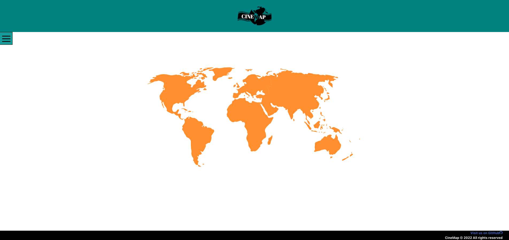
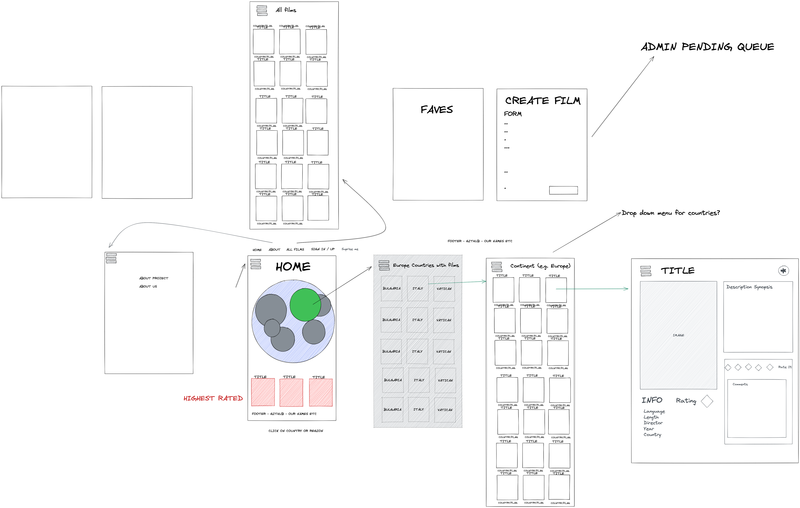

# CineMap
***

CineMap is a full stack MERN application (MongoDB, Express, React and Node) app that inspires its users to watch a new film, learn something new about that culture and/or part of the world and to incorporate worldwide travel in the form of user experience. The site also allows users to submit their own picks for films that aren't already listed on the site and create reviews and likes for the films. 

**This repo contains code for the back end server only; code for the front end client lives** [here](https://github.com/Dani-Gordon/CineMap-client.git)

## Installation
Check out the live application [here](https://cinemap.netlify.app/)! \
Feel free to register and then use your own login credentials, or try a demo one using:
- Username: Dani@email.com
- Password: Password1!\
Or run it locally (make sure you have a local version of MongoDB running in your terminal):\
**Front End:** Clone this repo, → run npm install → run npm run start:client \
**Back End:** Clone this repo → run npm install → run npm run seed → run npm run start:server**

## Goals and Timeframe: 
- Build a full-stack application using an Express API to serve your data with MongoDB. Consume your API with a React front-end. Have CRUD functionality. Implement thoughtful user stories/wireframes to help visualize your core MVP and stretch goals. Deploy app online so it's publicly accessible.
- 9 days

## Technologies Used:
React (JavaScript) | Sass | CSS | Bulma | MongoDB | Node | Express | JWT | Netlify | Heroku 

# Site Overview

>  CineMap as a non-logged in user provides the ability to view the map, choose a country by hovering and clicking on the map, view the films from that country view the entire film index(database)by choosing Film Index on the Navigation Menu as well as view a single film and it's description by clicking on any film card: 
>  
>     

> As a registered and logged in user of CineMap, features include "Hello (your name)!" on the Navbar to show the user, is in fact, logged in, a My Favs page to save all of the users favorite films in one place, a Random Film page for users feeling a bit indecisive that day, the ability to like/unlike a film, the ability to leave a review and rating, the ability to edit (as seen in video above) or delete your own review and, last but not least, a logout clickable link: 
> 
>       
    
>
>
>
# Project Overview
***

> The team met and discussed ideas for Project #3.  We discussed all the ideas each of us had for the project and decided on creating an app for World Cinema.  The inspiration for the project was wanting to the user to be inspired to watch a new film, learn something new about that culture and/or part of the world and to incorporate worldwide travel in the form of user experience.  The goal of the application was for the user to be able to click on parts of the world and see the films that have been created in that region/country or have the app choose a random movie for the user if desired. The information provided to the user would include the continent and country where the film was produced and/or production companies for the film operated, the director, languages the film is available in, the release year and length of the film. 

Once the idea was solidified, the team sketched out the framework for the idea itself using Excalidraw. See below: 

> We worked on planning out what our backend API would look like, including what models would be needed and the controllers required. Then we created a repository on GitHub. We discussed how to set up the backend and through VSCode and created a Trello board to lay out what tasks were needed for the backend to run. We all contributed to the Trello board, adding parts of the app that we knew needed to exist initially and then individually or collectively added tasks to it throughout the week. We utilized branches in Git to work on our task and merged each branch into the main branch, resolving any conflicts as they arose. If we had an idea that wasn't already on the list, we would add it to the "Ideas/Backlog" list. If we found something that needed updated or added something we wanted the team to review, we would add it to the "Things to review/check" list. We also had a "To Do", "Doing" and "SMASHED it! :)" list. Once completed with the previous task, we would add our name to tasks(cards) from the "Ideas/Backlog" and/or "To Do" list that weren't already taken by another team member to indicate who was going to complete them. We would then add the card to the "Doing" tab and move them to the "SMASHED it! :)" list once completed, unless it needed review and/or the team member needed some assistance brainstorming. Here is a snippet of our Trello board towards the end of the project.
> 
>  

> 
> 
> Once that was completed, we got started on creating those folders/files and entering the code to get it running on the Port specified.  The team was able to complete that portion and get it up and running on the Port, at which point we worked on the Models as a team, adding the User and Film Models to our project with the Schema’s we sketched out in addition to completing the seed.js file, filmData and userData files. Here are some code snippets of our work: 
> 
> **user.js Model-**\
>  
> 
> **film.js Model-** 
>   **-userData.js file** 

> Once completed, we divided up the controllers into the User Controller, Film Controller and Comments Controller. By the end of the day, the API was working on Postman, and we were able to create, read, update, and delete (CRUD) with the User and Film Controller functions. I worked on the Film Controller and added functions to also get all films, get a film by continent as well as get a film by its ID. 
> **filmController.js file-** 

> The project started on a Wednesday, and by end of day on Friday we had about 80% of our backend built for our MVP as well as some stretch goals. We knew if we didn't add the code into the backend to support frontend strech goals at that time, things could get tricky trying to add code into the backend later. The team felt confident heading into the weekend and ready to wrap up the backend and conquer the frontend, full steam ahead. 
>
> Below is a list of tasks (taken from our Trello board) that I completed and/or was directly involved with throughout Project week:
> 
> 

## Bugs: 

- 

## Challenges: 

- I worked on the NavBar for the better part of a day until I realized the Hamburger-React and Off-Canvas packages I had added to the project both had bugs and were not working as intended. I had to remove Off-canvas React Bootstrap and add code for a Sidebar, utilize state and Sass styling techniques to make the NavBar function in the desired way. 
- 

## Wins:

-	Finally getting the Navbar to slide out from the left hand side of the screen and not interfere with the app content.
-	

# Future Improvements/Features
***

Some additional features I would like to add to improve the app and create a more in-depth user experience:

-	 Originally, we planned to have every countries flag within each continent listed on the continent page that way the user could choose which country rather than filter through an index of films from all countries within that continent. We added this feature to the stretch goal list early on; however I belive this would be a great improvement to the app for future use.
-	To make the app more responsive for mobile/tablet use.

# Key Learnings
***
This was the first project during the SEI course where we worked in a group of 3, so I learned how important it is to communicate about every last detail (no matter how small or minute you think it is), in addition to how important is is to plan until you can't plan anymore, utilize Git branching and use Trello (or something similar) to map out tasks.

- I learned how to work on a project with a team using Git branching and, although we didn't have many, resolve merge conflicts when they occured.
- After more research, I learned that there are much easier methods to building a slide-out Navbar. I will be sure to utilize these methods in future apps!
