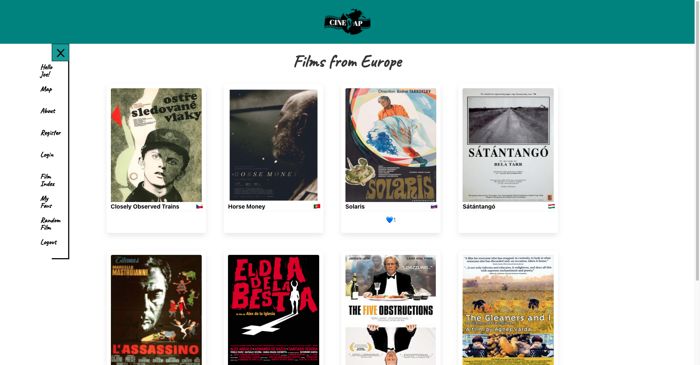
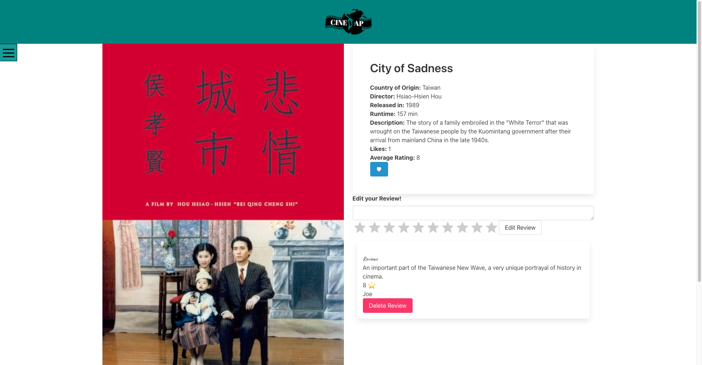

# CineMap
***

CineMap is a full stack MERN application (MongoDB, Express, React and Node) app that inspires its users to watch a new film, learn something new about that culture and/or part of the world and to incorporate worldwide travel in the form of user experience. The site also allows users to submit their own picks for films that aren't already listed on the site and create reviews and likes for the films. 

**This repo contains code for the back end server only; code for the front end client lives** [here](https://github.com/Dani-Gordon/CineMap-client.git)

## Installation
Check out the live application [here](https://cinemap.netlify.app/)! \
Feel free to register and then use your own login credentials, or try a demo one using:
- Username: Dani@email.com
- Password: Password1!\
Or run it locally (make sure you have a local version of MongoDB running in your terminal):\
**Front End:** Clone this repo, → run npm install → run npm run start:client \
**Back End:** Clone this repo → run npm install → run npm run seed → run npm run start:server**

## Goals and Timeframe: 
- Build a full-stack application using an Express API to serve your data with MongoDB. Consume your API with a React front-end. Have CRUD functionality. Implement thoughtful user stories/wireframes to help visualize your core MVP and stretch goals. Deploy app online so it's publicly accessible.
- 7 days

## Technologies Used:
React (JavaScript) | Sass | CSS | Bulma | MongoDB | Node | Express | JWT | Netlify | Heroku 

# Site Overview

>
>          
>  
>       
>  
>  
>
>

# Project Overview
***

> The team met and discussed ideas for Project #3.  We discussed all the ideas each of us had for the project and decided on creating an app for World Cinema.  The inspiration for the project was wanting to the user to be inspired to watch a new film, learn something new about that culture and/or part of the world and to incorporate worldwide travel in the form of user experience.  The goal of the application was for the user to be able to click on parts of the world and see the films that have been created in that region/country or have the app choose a random movie for the user if desired. The information provided to the user would include the continent and country where the film was produced and/or production companies for the film operated, the director, languages the film is available in, the release year and length of the film. 

Once the idea was solidified, the team sketched out the framework for the idea itself using Excalidraw. See below: 

> We worked on planning out what our backend API would look like, including what models would be needed and the controllers required. Then we created a repository on GitHub. We discussed how to set up the backend and through VSCode and created a Trello board to lay out what tasks were needed for the backend to run. 
> 
>  
> 
> 
> Once that was completed, we got started on creating those folders/files and entering the code to get it running on the Port specified.  The team was able to complete that portion and get it up and running on the Port, at which point we worked on the Models as a team, adding the User and Film Models to our project with the Schema’s we sketched out in addition to completing the seed.js file, filmData and userData files. Here are some code snippets of our work: 
> 
> **user.js Model-**\
>  
> 
> **film.js Model-** 
>   **-userData.js file** 

> Once completed, we divided up the controllers into the User Controller, Film Controller and Comments Controller. By the end of the day, the API was working on Postman, and we were able to create, read, update, and delete (CRUD) with the User and Film Controller functions. I worked on the Film Controller and added functions to also get all films, get a film by continent as well as get a film by its ID. 
>**filmController.js file-** 

## Major Hurdles
